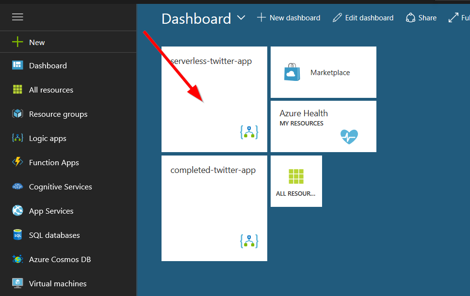
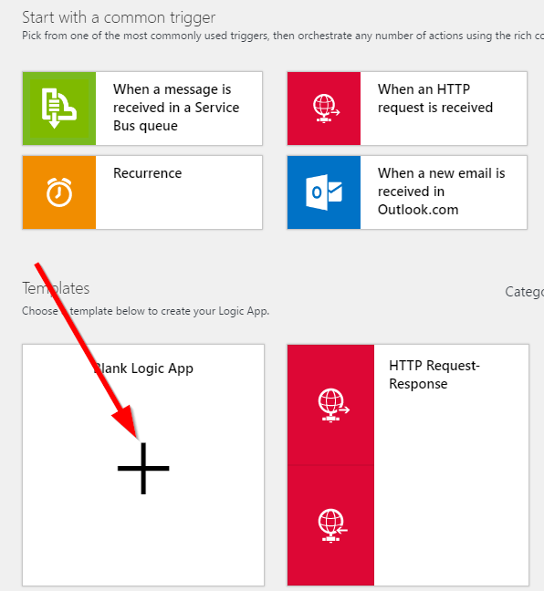
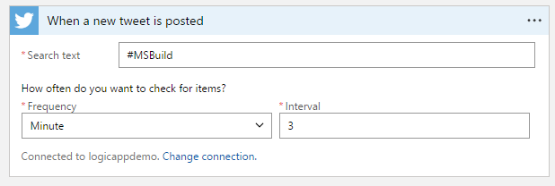
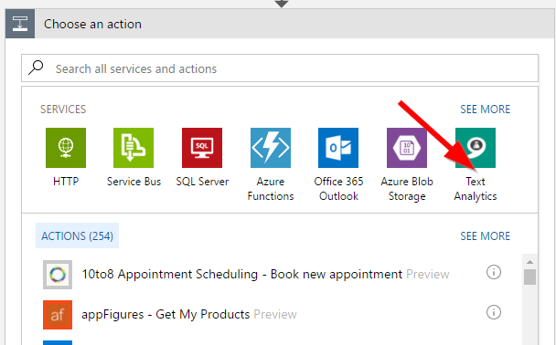
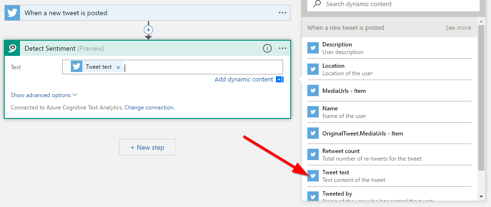
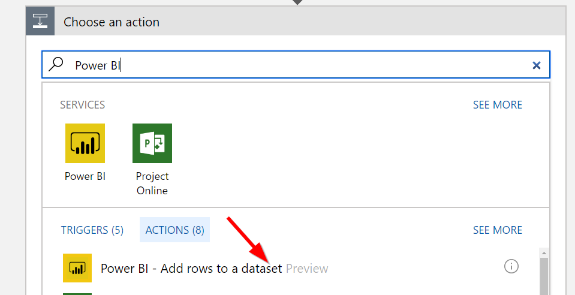
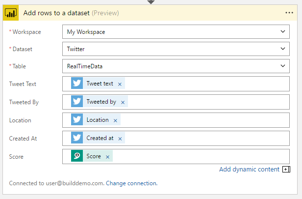

# Build Demo Walkthrough

## USER ACCOUNT

## Building the app in Azure

1. Go to the [Azure Portal](https://portal.azure.com)
2. Login with the user account above 
3. Click on the `serverless-twitter-app` to open the app  

      

4. Click on **Blank Logic App**  

      

5. Choose the **Twitter** connector and **When a new tweet is posted**.  Type in `#MSBuild` to listen to tweets on Build  

      

6. Click to add a **New Step**, then **Add an action** and add the **Text Analytics** connector  

      

7. Choose the **Detect Sentiment** action and select to analyze the **Tweet Text**  

      

8. Add another action, and this time type to find the **Power BI** connector to **Add rows to a dataset**  

      

9. Select the following:  

|Field|Value|
|--|--|
|Workspace|My Workspace|
|Dataset|Twitter|
|Table|RealTimeData|

10. Fill in the **Tweet Text**, **Tweeted By**, **Location**, **Created At**, and **Score** properties.  
    * **Note** - the **Created At** property is under the SEE MORE for Twitter - or can be found using the search bar

      

That's it! You can now view the dashboard by logging into [Power BI](https://app.powerbi.com) with the user account above.